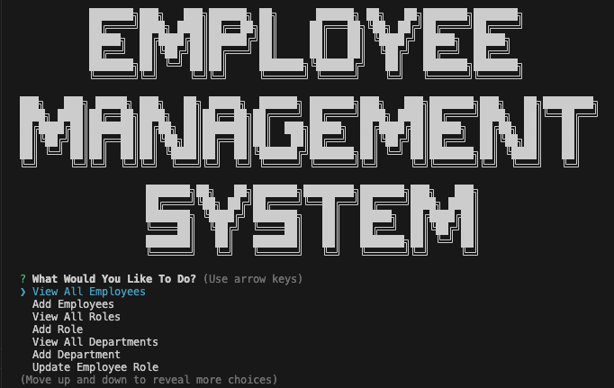
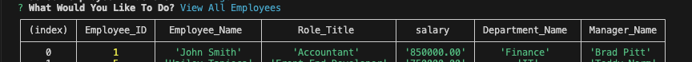
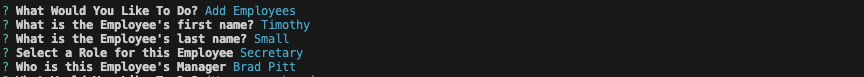

# Employee Management System
 
## Description

This project has been created to assist with tracking employees, roles and departments within a business and has been completed as a part of the Adelaide University Web Development bootcamp. The motivation for this project has been to create a user interface within the command line which allows the user to perform various tasks such as viewing, adding, deleting and updating key business departments, roles and employees. This has been completed with the help of mySQL and express.js. 

Completing this project was a useful lesson in maintaining a SQL database by dynamically making queries, inserting, deleting and updating data. 

## Installation
To install this Employee Management System, simply clone this repository to your local computer 

Once installed you will need to navigate to the repository and install all necessary node packages with 'npm i'

Then, run the program by entering 'npm start' into the terminal

## Usage
Please find a demo video here: https://drive.google.com/file/d/1kNMnzSbuKylbsuunj5DH9O5JqClZmcSh/view?usp=sharing

Once you have launched the 'Employee Management System' you will be presented with the following options:

You can scroll through all the options provided and select them with 'Enter', as an example, selecting view employees will provide the following table:

If you select to add either an employee, role or department you will be prompted with the appropriate questions associated with that tables necessary values. 

A similar process can be found with each selected process. YOu will be prompted to either select an option from a list or provide a text response which will then be used to complete your desired process. 
